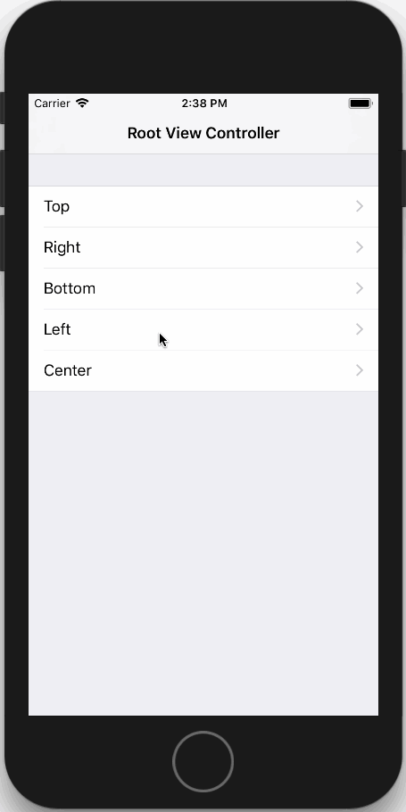
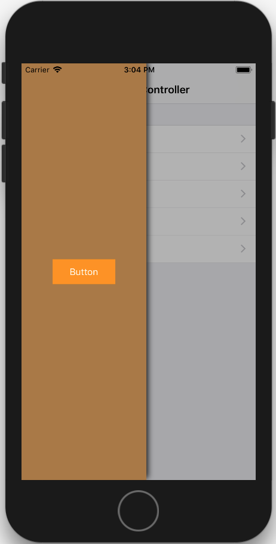
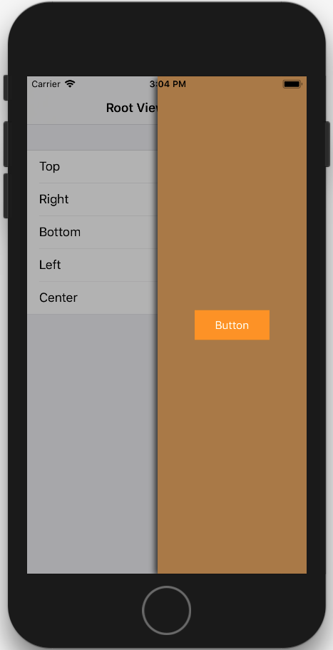
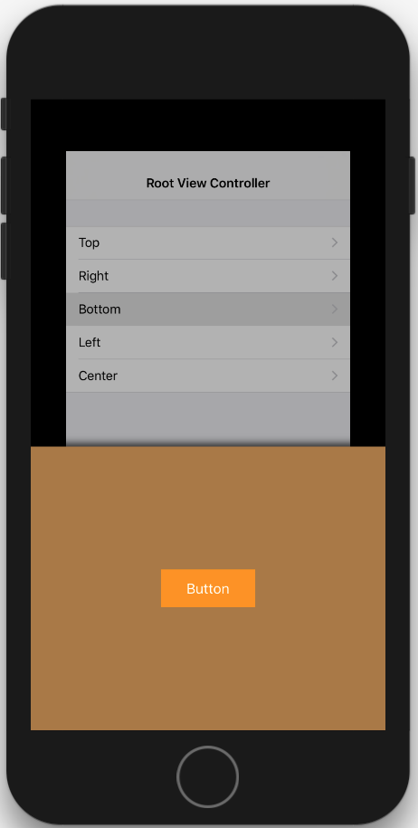

# iOS-Modal

[]()
[]()
[]()
[]()

iOS 模态窗口，内置类似淘宝添加购物车的模态视图动画，内部使用 iOS8 推出的`UIPresentationController`来实现模态窗口功能。

该项目是[`SemiModal`](https://github.com/xiaopin/SemiModal.git)的增强版，在SemiModal的基础上增加了指定模态窗口出现的位置方向（参看`ModalDirection`枚举），以适应更多的使用场景。


## TODO

- 提供Objective-C版本

## 特性

- 丰富的配置，适应多种使用场景
- 支持交互式转场动画（当启动背景动画时，建议关闭该功能）
- 简单易用的API，使用者只需关心 UIViewController 通过 extension 所提供的方法


## 环境要求

- iOS8.0+
- Swift4.0+
- Xcode9.0+


## 用法

- 将`UIViewController+Modal.swift`拖入你的项目即可

- 示例代码

1. 弹出控制器

```Swift
let vc = UIViewController()
vc.view.backgroundColor = .cyan
presentModalViewController(vc, contentSize: CGSize(width: 200.0, height: 300.0), configuration: .default, completion: nil)
```

2. 弹出自定义视图

```Swift
let view = UIView()
view.backgroundColor = .brown
presentModalView(view, contentSize: CGSize(width: 200.0, height: 300.0), configuration: .default, completion: nil)
```

## 演示

[]()

[]()

[]()

[]()

[]()

## 致谢

- [KNSemiModalViewController](https://github.com/kentnguyen/KNSemiModalViewController)
- [SemiModal](https://github.com/xiaopin/SemiModal.git)
- [Custom View Controller Presentations and Transitions](https://developer.apple.com/library/content/samplecode/CustomTransitions/Introduction/Intro.html#//apple_ref/doc/uid/TP40015158)

感谢他们对开源社区做出的贡献。

## 协议

被许可在 MIT 协议下使用，查阅`LICENSE`文件来获得更多信息。
